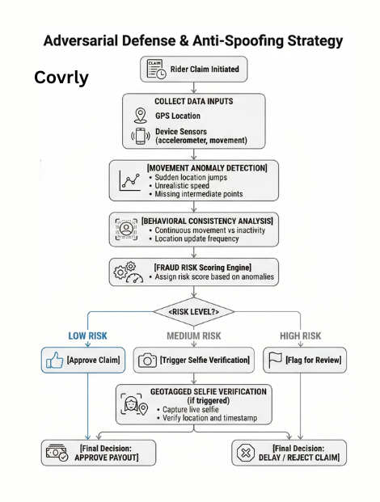

# 1. Problem Statement 

India’s gig economy workers such as delivery partners working with platforms like Zomato, Swiggy, Zepto, Amazon, Delhivery and eKart and are highly dependent on daily working hours for income. External disruptions such as extreme weather, heavy pollution, or natural disasters can significantly reduce their ability to work.  

These disruptions can lead to a 20–30% loss in monthly income, and currently gig workers have no income protection against such uncontrollable events. 

This project proposes an AI-enabled parametric insurance platform that automatically protects gig workers against income loss caused by environmental disruptions. 

The system will automatically detect disruption events and trigger payouts without requiring manual claims. 

## Important Constraint: The system does NOT provide coverage for: 

- Health insurance 
- Life insurance 
- Accident insurance 
- Vehicle repair insurance 

---

## The insurance only covers income loss caused by environmental disruptions and social disruptions. 

- Unplanned curfews/local strikes  
- sudden market/zone closures 
- Unprecedented heavy Rainfall
- Inaccessible Deliverly location

which contribute to the inability to access pickup/drop locations 

---

### Selected Delivery Category   --->  Food Delivery Gigs (Zomato / Instamart) 

---

# 2. User Personas 

## Persona 1: Full-Time Urban Food Delivery Rider 

<p align="center">
  
</p>

Name: Ravi NagaRaju  
Age: 27  
City: Bengaluru  
Platform: Zomato  
Vehicle: Motorcycle 

### Work Pattern 

- Works 10–12 hours per day 
- Completes 25–35 deliveries daily 
- Average income ₹900 – ₹1300 per day 

### Key Risks 

- Heavy rain reducing order volume 
- Flooded roads making deliveries impossible 
- Severe traffic congestion during peak hours 
- Restaurant shutdowns during emergencies 

### Income Loss Scenario 

During heavy rain days, he completes only 8–10 deliveries instead of 30, losing ₹200–₹400 income. 

### Possible Parametric Triggers 

- Rainfall > 70 mm 
- Flood alert issued in delivery zone 
- Traffic congestion index > threshold 

### Weekly Insurance Example 

Premium: ₹20/week  
Coverage: ₹500 payout per disruption event 


---

## Persona 2: Tier-1 City Parcel Delivery Agent 

<p align="center">
  
</p>

Name: Arjun Sharma  
Age: 21  
City: Delhi  
Platform: Swiggy  
Vehicle: Electric Scooter 

### Work Pattern 

- Works evenings (5 PM – 10 PM) 
- Completes 10–15 deliveries per shift 
- Average income ₹400 – ₹700 per day 

### Key Risks 

- Extreme heat during summer evenings 
- High air pollution affecting outdoor work 
- Sudden curfews or city restrictions 

### Income Loss Scenario 

During heatwaves (>49°C), he avoids working and loses ₹500 income. 

### Possible Parametric Triggers 

- Temperature > 49°C 
- AQI > 400 
- Heatwave alert issued 

### Weekly Insurance Example 

Premium: ₹10/week  
Coverage: ₹300–₹500 payout 


---

## Customer Journey Map 

<p align="center">
  
</p>

---

# 3.Application Workflow 

- Gig worker registers on the platform. 
- User subscribes to weekly insurance coverage. 
- System continuously monitors external data such as: 
  - Weather conditions 
  - Natural disaster alerts 
  - Social Disruptions (Curfew, Riots, Strikes) 

- If disruption conditions exceed predefined thresholds, the system activates a parametric trigger. 
- The system automatically calculates the payout amount. 
- After claiming and proper validation payment is transferred directly to the worker’s account. 

<p align="center">
  
</p>

---

# 4. Weekly Premium Model 

Gig workers typically receive payments on a weekly cycle. Therefore, the insurance model is designed with weekly subscription pricing. 

Example model: 

Weekly Premium = ₹30 – ₹70 

Premium calculation depends on: 

- City risk level 
- Weather volatility 
- Historical disruption frequency 
- Average worker earnings 

Example: 

This ensures the platform remains affordable for gig workers. 

| Risk Level        | Weekly Premium |
|------------------|---------------|
| Low Risk City    | ₹30           |
| Medium Risk City | ₹50           |
| High Risk City   | ₹70           |

---

# 5. Parametric Triggers 

Parametric insurance automatically activates payouts when predefined conditions occur. 

| Trigger Condition        | Payout Activation |
|------------------------|------------------|
| Rainfall > 100 mm      | Payout activated |
| Air Quality Index >1000| Payout activated |
| Temperature > 45°C     | Payout activated |
| Cyclone / Flood Alert  | Payout activated |

Since triggers are based on trusted external data sources, claim suggestions will popup but manual claim process is required. 

---

# 6. Platform Choice 

This solution will be developed primarily as a Mobile/smartphone-based platform  

Used for: 

- Registration 
- Policy management 
- Dashboard 
- Notifications 
- Real-time alerts 
- Easy subscription 

Mobile accessibility is important because gig workers rely heavily on smartphones during work. No gig worker will get the time or will to open a website/webApp to avail the services provided by us. 

---

# 7. AI / ML Integration 

Artificial Intelligence will play a key role in the platform. 

## a. Dynamic Premium Calculation 

Machine learning models will analyze: 

- Historical weather data 
- Income loss patterns 
- Regional disruption frequency 

This helps generate dynamic weekly premiums. 

---> Models we can use  

- Linear Regression 
- Random Forest 
- Gradient Boosting 

---

## b. Fraud Detection 

AI will detect suspicious patterns such as: 

- Unusual claim patterns 
- Location mismatch 
- AI adulteration in the uploaded proof 

Examples: 

- Fake weather claims 
- Duplicate claims 
- Manipulated Proofs’ 

Methods: 

- anomaly detection 
- location validation 
- activity verification 

---> Using Algorithms like  

- Isolation Forest 
- Random Forest 
- Logistic Regression 

---

## c. Risk Prediction 

AI models will predict the likelihood of disruption events based on environmental data. 

- Weather APIs 
- Traffic APIs 

Examples: 

- OpenWeather API 
- Google traffic API 

A Potential way to detect any socio disruption:- 

We must rely on multiple statistics which will work as a stimulus for the detection model 	              
             The stimulus condition is: 
```pseudo 
                          IF (Weather Normal)
                                 AND (traffic drop > 70%)
                                 AND (delivery activity drop > 80%)
                          THEN Social Disruption Detected
```
---

## Adversarial Defense & Anti-Spoofing Strategy

To mitigate advanced GPS spoofing attacks and coordinated fraud attempts, the system adopts a multi-layered behavioral verification approach instead of relying solely on GPS coordinates.

---

### a. Movement Anomaly Detection

The system continuously analyzes time-series location data to detect abnormal movement patterns that indicate possible spoofing.

#### Key Checks

- Sudden location jumps:
  - Large distance changes within a very short time interval  

- Unrealistic speed estimation:
  - Speed exceeding physical limits for a delivery vehicle  

- Unnatural movement patterns:
  - Teleportation-like transitions  
  - Missing intermediate GPS points  
  - Perfect straight-line paths indicating synthetic movement  

#### Detection Logic

```pseudo
IF (Distance Change > X km in < Y seconds)
OR (Speed > Max Threshold)
OR (Missing Intermediate Points)
THEN Movement Anomaly Detected
```
---

### b. Behavioral Consistency Analysis

The system evaluates whether the rider’s activity aligns with realistic delivery behavior by analyzing session-level patterns.

#### Signals Considered

- Continuous movement vs prolonged inactivity  
- Frequency and consistency of location updates  

#### Key Observations

- Genuine delivery riders exhibit continuous and dynamic movement patterns  
- Regular location updates with gradual transitions   

- Suspicious users often show:
  - Long periods of inactivity followed by sudden claim initiation  
  - Irregular or sparse location updates   

#### Detection Logic

```pseudo
IF (User claims disruption)
AND (Movement History shows prolonged inactivity)
AND (Low frequency of location updates)
THEN Suspicious Behavior
```
---

### c. Risk Scoring Engine

The system assigns a cumulative fraud risk score based on detected anomalies and behavioral inconsistencies.

#### Example Weights

| Signal | Weight |
|--------|--------|
| Location jump | +0.3 |
| High speed | +0.2 |
| Static behavior | +0.2 |
| Pattern anomaly | +0.3 |

#### Decision Logic

```pseudo
IF (Fraud Score < 0.3)
→ Auto Approve

IF (0.3 ≤ Fraud Score < 0.7)
→ Soft Verification

IF (Fraud Score ≥ 0.7)
→ High Risk Flag
```

---

### d. Geotagged Selfie Verification

When the fraud risk score crosses a defined threshold, the system initiates a real-time verification step to confirm the user's authenticity.

#### Process

- The user is prompted to capture a live selfie  
- The image is geotagged and timestamped  
- Additional checks may include:
  - Liveness detection (blink or movement verification)  
  - Environmental consistency checks

#### Purpose

This step ensures that:

- The user is physically present at the claimed location  
- The claim is being made in real-time  
- Spoofed or automated claims are filtered out  


#### User Experience Consideration

- Verification is only triggered when necessary  
- The process is designed to be quick and minimally intrusive  
- Genuine users can complete verification within seconds     

#### Trigger Logic

```pseudo
IF (Fraud Score ≥ Threshold)
THEN Request Geotagged Selfie
```
---

### e. Final Decision Model

The system combines movement analysis, behavioral consistency, and verification results to determine claim validity.

#### Decision Logic

```pseudo
IF (Movement Natural)
AND (Speed Realistic)
AND (Behavior Pattern Validation)
THEN Approve Claim

ELSE
    Increase Fraud Score
    IF (Threshold Crossed)
    THEN Trigger Selfie Verification
```
#### Detection Workflow

<p align="center">
  
</p>

---

# 8. Tech Stack 

## Frontend (Mobile) 

- React Native 
- Expo 
- JavaScript / TypeScript 
- React Navigation 
- React Native Paper / Native Base 
- Axios 

---

## Backend 

- FastAPI (Python) – REST APIs  

---

## Event-Driven Architecture with Apache Kafka

To support real-time fraud detection, disruption monitoring, and instant claim processing, the platform uses an event-driven architecture powered by Apache Kafka.

In this system, every critical action—such as location updates, anomaly detection, and claim initiation—is treated as an event and streamed through Kafka.

This allows different components (AI models, fraud detection, trigger engine) to process data independently and in real time.


### Role of Apache Kafka

Apache Kafka is used to stream and process real-time events across the system.

It enables:

- Stream real-time rider location data for movement analysis  
- Trigger fraud detection pipelines when anomalies are detected  
- Process claim-related events asynchronously  
- Enable instant parametric claim triggering based on external disruptions

---

## Database 

- MySQL / MongoDB 

---

## AI/ML 

- Python 
- Pandas 
- Numpy 
- Scikit-Learn 
- TensorFlow 

---

## APIs 

- Weather API  (ex-OpenWeather API) 
- Traffic-Congestion API  (ex-Google traffic API) 
- Platform APIs  
- Payment gateways (ex- Razor Pay) 
---

## Payments 

- Razorpay test mode
---

## The Protoype - Covrly

#### HereBy, We are attaching the link of our protoype created on Figma. 
##### The protoype is aided with button/Page navigation and efforts to correctly and closely simulate the working of the Real Application.

The Protoype Link -->  https://www.figma.com/proto/IM3m6sVzgNUzK4ue1wnpyG/GigShield-Worker-App?node-id=0-1&t=QFABHBgN9znTk8mq-1