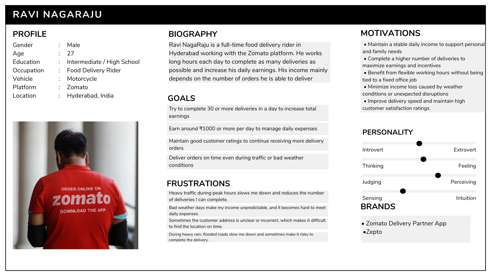
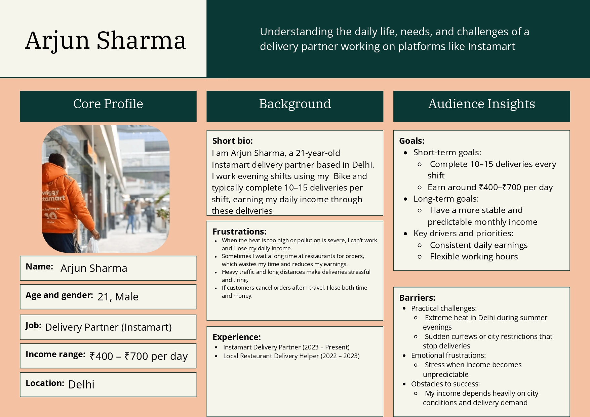
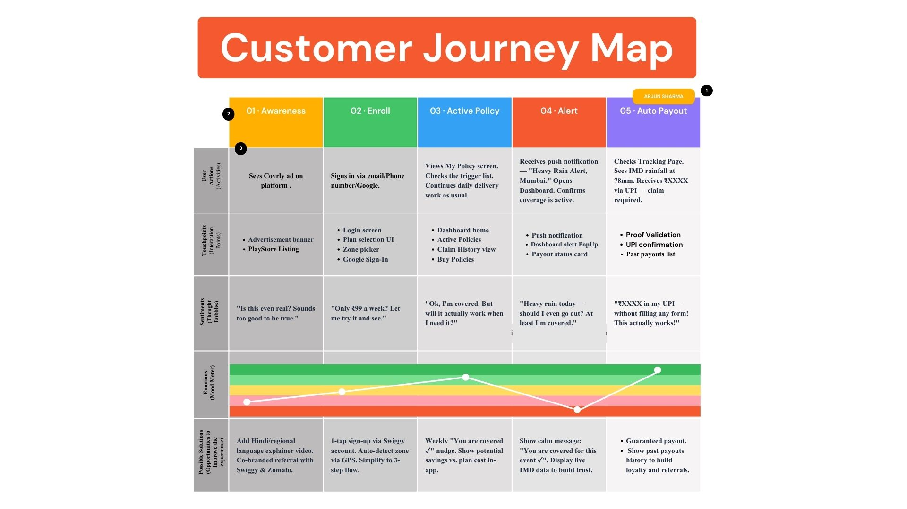
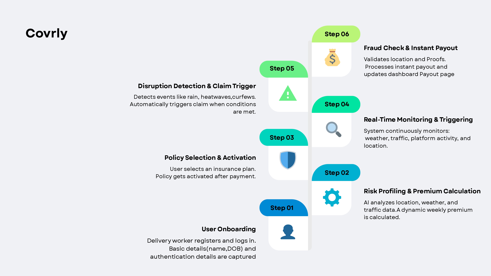

# 1. Problem Statement 

India’s gig economy workers such as delivery partners working with platforms like Zomato, Swiggy, Zepto, Amazon, Delhivery and eKart and are highly dependent on daily working hours for income. External disruptions such as extreme weather, heavy pollution, or natural disasters can significantly reduce their ability to work.  

These disruptions can lead to a 20–30% loss in monthly income, and currently gig workers have no income protection against such uncontrollable events. 

This project proposes an AI-enabled parametric insurance platform that automatically protects gig workers against income loss caused by environmental disruptions. 

The system will automatically detect disruption events and trigger payouts without requiring manual claims. 

## Important Constraint: The system does NOT provide coverage for: 

- Health insurance 
- Life insurance 
- Accident insurance 
- Vehicle repair insurance 

The insurance only covers income loss caused by environmental disruptions and social disruptions. 

- Unplanned curfews  
- local strikes  
- sudden market/zone closures 

which contribute to the inability to access pickup/drop locations 


Selected Delivery Category   --- Food Delivery Gigs (Zomato / Instamart) 

---

# 2. User Personas 

## Persona 1: Full-Time Urban Food Delivery Rider 

<p align="center">
  
</p>

Name: Ravi NagaRaju  
Age: 27  
City: Bengaluru  
Platform: Zomato  
Vehicle: Motorcycle 

### Work Pattern 

- Works 10–12 hours per day 
- Completes 25–35 deliveries daily 
- Average income ₹900 – ₹1300 per day 

### Key Risks 

- Heavy rain reducing order volume 
- Flooded roads making deliveries impossible 
- Severe traffic congestion during peak hours 
- Restaurant shutdowns during emergencies 

### Income Loss Scenario 

During heavy rain days, he completes only 8–10 deliveries instead of 30, losing ₹400–₹600 income. 

### Possible Parametric Triggers 

- Rainfall > 70 mm 
- Flood alert issued in delivery zone 
- Traffic congestion index > threshold 

### Weekly Insurance Example 

Premium: ₹20/week  
Coverage: ₹500 payout per disruption event 


---

## Persona 2: Tier-1 City Parcel Delivery Agent 

<p align="center">
  
</p>

Name: Arjun Sharma  
Age: 21  
City: Delhi  
Platform: Swiggy  
Vehicle: Electric Scooter 

### Work Pattern 

- Works evenings (5 PM – 10 PM) 
- Completes 10–15 deliveries per shift 
- Average income ₹400 – ₹700 per day 

### Key Risks 

- Extreme heat during summer evenings 
- High air pollution affecting outdoor work 
- Sudden curfews or city restrictions 

### Income Loss Scenario 

During heatwaves (>49°C), he avoids working and loses ₹500 income. 

### Possible Parametric Triggers 

- Temperature > 49°C 
- AQI > 400 
- Heatwave alert issued 

### Weekly Insurance Example 

Premium: ₹10/week  
Coverage: ₹300–₹500 payout 


---

Customer Journey Map 

<p align="center">
  
</p>

---

# 3.Application Workflow 

- Gig worker registers on the platform. 
- User subscribes to weekly insurance coverage. 
- System continuously monitors external data such as: 
  - Weather conditions 
  - Natural disaster alerts 
  - Social Disruptions (Curfew, Riots, Strikes) 

- If disruption conditions exceed predefined thresholds, the system activates a parametric trigger. 
- The system automatically calculates the payout amount. 
- Payment is transferred directly to the worker’s account. 

<p align="center">
  
</p>

---

# 4. Weekly Premium Model 

Gig workers typically receive payments on a weekly cycle. Therefore, the insurance model is designed with weekly subscription pricing. 

Example model: 

Weekly Premium = ₹30 – ₹70 

Premium calculation depends on: 

- City risk level 
- Weather volatility 
- Historical disruption frequency 
- Average worker earnings 

Example: 

This ensures the platform remains affordable for gig workers. 

| Risk Level        | Weekly Premium |
|------------------|---------------|
| Low Risk City    | ₹30           |
| Medium Risk City | ₹50           |
| High Risk City   | ₹70           |

---

# 5. Parametric Triggers 

Parametric insurance automatically activates payouts when predefined conditions occur. 

| Trigger Condition        | Payout Activation |
|------------------------|------------------|
| Rainfall > 100 mm      | Payout activated |
| Air Quality Index > 400| Payout activated |
| Temperature > 45°C     | Payout activated |
| Cyclone / Flood Alert  | Payout activated |

Since triggers are based on trusted external data sources, claim suggestions will popup but manual claim process is required. 

---

# 6. Platform Choice 

This solution will be developed primarily as a Mobile/smartphone-based platform  

Used for: 

- Registration 
- Policy management 
- Dashboard 
- Notifications 
- Real-time alerts 
- Easy subscription 

Mobile accessibility is important because gig workers rely heavily on smartphones during work. No gig worker will get the time or will to open a website/webApp to avail the services provided by us. 

---

# 7. AI / ML Integration 

Artificial Intelligence will play a key role in the platform. 

## a. Dynamic Premium Calculation 

Machine learning models will analyze: 

- Historical weather data 
- Income loss patterns 
- Regional disruption frequency 

This helps generate dynamic weekly premiums. 

---> Models we can use  

- Linear Regression 
- Random Forest 
- Gradient Boosting 

---

## b. Fraud Detection 

AI will detect suspicious patterns such as: 

- Unusual claim patterns 
- Location mismatch 
- AI adulteration in the uploaded proof 

Examples: 

- Fake weather claims 
- Duplicate claims 
- Manipulated Proofs’ 

Methods: 

- anomaly detection 
- location validation 
- activity verification 

---> Using Algorithms like  

- Isolation Forest 
- Random Forest 
- Logistic Regression 

---

## c. Risk Prediction 

AI models will predict the likelihood of disruption events based on environmental data. 

- Weather APIs 
- Traffic APIs 

Examples: 

- OpenWeather API 
- Google traffic API 

A Potential way to detect any socio disruption:- 

We must rely on multiple statistics which will work as a stimulus for the detection model 	              
             The stimulus condition is: 
```pseudo 
                          IF (Weather Normal)
                                 AND (traffic drop > 70%)
                                 AND (delivery activity drop > 80%)
                          THEN Social Disruption Detected
```
---

# 8. Tech Stack 

## Frontend (Mobile) 

- React Native 
- Expo 
- JavaScript / TypeScript 
- React Navigation 
- React Native Paper / Native Base 
- Axios 

---

## Backend 

- FastAPI (Python) – REST APIs  

---

## Database 

- MySQL / MongoDB 

---

## AI/ML 

- Python 
- Pandas 
- Numpy 
- Scikit-Learn 
- TensorFlow 

---

## APIs 

- Weather API  (ex-OpenWeather API) 
- Traffic-Congestion API  (ex-Google traffic API) 
- Platform APIs  
- Payment gateways (ex- Razor Pay) 
---

## Payments 

- Razorpay test mode
